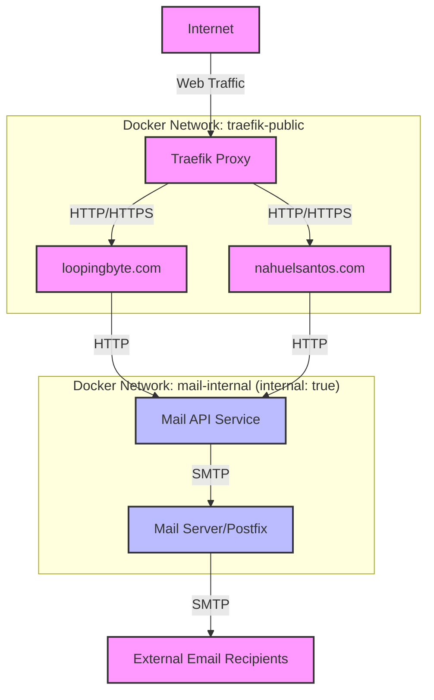

# Secure Mail API Setup for Multiple Websites

This document explains how the mail service is securely configured to only be accessible to your websites running on the Raspberry Pi (Dinky).

## Security Architecture



### Key Components and Security Measures:

1. **Internal Network Isolation**:
   - Mail API and mail server run on their own internal Docker network
   - This network is configured with `internal: true`, making it inaccessible from outside Docker

2. **No Public Exposure via Traefik**:
   - Mail API has no Traefik labels, so it's not exposed to the internet
   - Only your websites are exposed through Traefik

3. **Controlled Access for Your Websites**:
   - Your websites connect to both:
     - Traefik's network (for incoming public traffic)
     - The internal mail network (for sending emails)

## How to Set Up Your Websites

1. **Add the mail-internal network to your website services**:
   ```yaml
   networks:
     - default
     - traefik-public
     - mail-internal  # This is the secure internal network
   ```

2. **Configure your website's contact form**:
   - Set the form submission endpoint to use the environment variable: `MAIL_API_URL`
   - Inside Docker, this will resolve to: `http://mail-api:8080/send`

3. **Example form processing code**:

   ```javascript
   // Example contact form handler (Node.js)
   app.post('/contact', async (req, res) => {
     try {
       const response = await fetch(process.env.MAIL_API_URL, {
         method: 'POST',
         headers: { 'Content-Type': 'application/json' },
         body: JSON.stringify({
           to: "your-email@example.com",
           subject: "Contact Form Submission from Your Website",
           body: `Name: ${req.body.name}\nEmail: ${req.body.email}\nMessage: ${req.body.message}`,
           html: false
         })
       });
       
       const result = await response.json();
       if (result.success) {
         res.status(200).send({ message: "Message sent successfully" });
       } else {
         res.status(500).send({ message: "Failed to send message" });
       }
     } catch (error) {
       res.status(500).send({ message: "An error occurred" });
     }
   });
   ```

## Security Benefits

This architecture provides several security benefits:

1. **Zero Public Attack Surface**:
   - Mail API is completely inaccessible from the internet
   - No public-facing API endpoints that could be abused

2. **Network-level Isolation**:
   - Even if someone gained access to your Raspberry Pi, they couldn't access the mail API without being on the correct Docker network

3. **No Authentication Needed**:
   - Because access is controlled at the network level, you don't need to implement API keys or authentication
   - Simplifies your website code while maintaining security

## Testing the Integration

To test if your websites can access the mail API:

1. SSH into your Raspberry Pi
2. Run this command to check connectivity from your website container:
   ```
   docker exec loopingbyte-website curl -X POST http://mail-api:8080/send \
     -H "Content-Type: application/json" \
     -d '{"to":"test@example.com","subject":"Test","body":"Test email from website container"}'
   ```

If you see a success response, your integration is working correctly. 