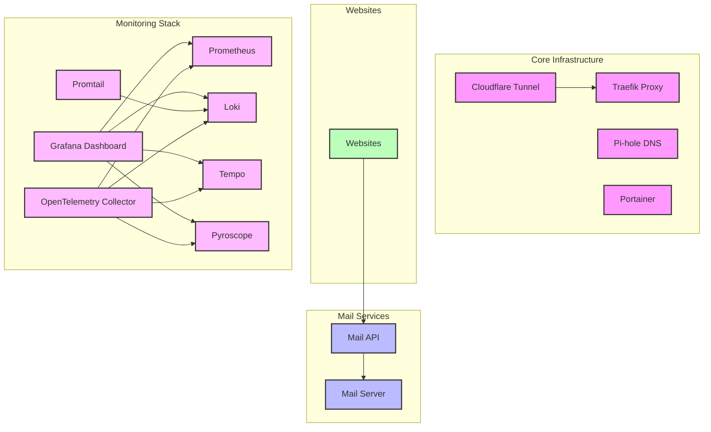
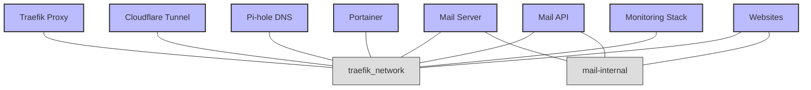

# System Dependencies

This document outlines all dependencies between components in the Dinky Server system using visual diagrams.

## Service Dependencies

## Network Dependencies

## Environment Variable Dependencies

```mermaid
graph TD
    %% Environment Files
    EnvFile[.env File]
    
    %% Services
    Traefik[Traefik Proxy]
    Cloudflared[Cloudflare Tunnel]
    Pihole[Pi-hole DNS]
    MailServer[Mail Server]
    MailAPI[Mail API]
    Grafana[Grafana]
    
    %% Environment Variables
    EnvFile --> |SERVER_IP| Traefik
    EnvFile --> |DOMAIN_NAME| Traefik
    EnvFile --> |TUNNEL_ID| Cloudflared
    EnvFile --> |TUNNEL_TOKEN| Cloudflared
    EnvFile --> |PIHOLE_PASSWORD| Pihole
    
    EnvFile --> |MAIL_DOMAIN| MailServer
    EnvFile --> |MAIL_HOSTNAME| MailServer
    EnvFile --> |DEFAULT_FROM| MailServer
    EnvFile --> |SMTP_RELAY_HOST| MailServer
    EnvFile --> |SMTP_RELAY_PORT| MailServer
    EnvFile --> |SMTP_RELAY_USERNAME| MailServer
    EnvFile --> |SMTP_RELAY_PASSWORD| MailServer
    EnvFile --> |USE_TLS| MailServer
    
    EnvFile --> |DEFAULT_FROM| MailAPI
    EnvFile --> |ALLOWED_HOSTS| MailAPI
    
    EnvFile --> |GRAFANA_PASSWORD| Grafana
    
    %% Styling
    classDef env fill:#fbb,stroke:#333,stroke-width:2px;
    classDef service fill:#bbf,stroke:#333,stroke-width:2px;
    
    class EnvFile env;
    class Traefik,Cloudflared,Pihole,MailServer,MailAPI,Grafana service;
```

## Configuration Dependencies

Key configuration files and their relationships:

* `docker-compose.yml` - Main configuration file defining all services
* `.env` - Environment variables used by all services
* `services/mail-server/postfix-main.cf` - Postfix configuration template
* `services/mail-server/start.sh` - Mail server startup script
* `apis/mail-api/main.go` - Mail API source code
* `infrastructure/traefik/traefik.yml` - Traefik configuration
* `infrastructure/cloudflared/config.yml` - Cloudflare Tunnel configuration
* `monitoring/prometheus/prometheus.yml` - Prometheus configuration

## Required Configuration

The following environment variables must be configured in `.env` for proper operation:

### Core Infrastructure
* `PROJECT` - Project name
* `DOMAIN_NAME` - Base domain for all services
* `SERVER_IP` - IP address of the server
* `TUNNEL_ID` - Cloudflare Tunnel ID
* `TUNNEL_TOKEN` - Cloudflare Tunnel Token
* `PIHOLE_PASSWORD` - Pi-hole admin password

### Mail Services
* `MAIL_DOMAIN` - Domain for mail services
* `MAIL_HOSTNAME` - Hostname for mail server
* `DEFAULT_FROM` - Default sender email address
* `SMTP_RELAY_HOST` - SMTP relay host (usually smtp.gmail.com)
* `SMTP_RELAY_PORT` - SMTP relay port (usually 587)
* `SMTP_RELAY_USERNAME` - SMTP relay username
* `SMTP_RELAY_PASSWORD` - SMTP relay password (app password for Gmail)
* `USE_TLS` - Whether to use TLS (yes/no)

### Monitoring
* `GRAFANA_PASSWORD` - Grafana admin password 