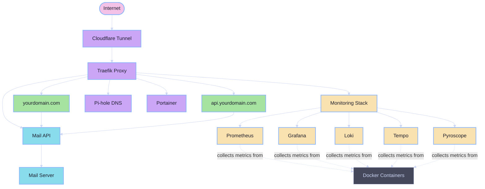

This page provides a high-level overview of the Dinky Server architecture and how the various components work together.

## Architecture Diagram

## Core Components

### 1. Core Infrastructure

- **Traefik**: Acts as the central reverse proxy, routing all traffic to the appropriate services. It manages HTTP/HTTPS connections and provides automatic SSL termination.

- **Cloudflared**: Creates a secure tunnel from Cloudflare to your local server, allowing you to expose services to the internet without opening ports in your firewall.

- **Pi-hole**: Provides network-wide ad blocking and local DNS resolution, improving privacy and reducing unwanted content.

- **Portainer**: Offers a web interface for managing Docker containers, making it easy to monitor and control your services.

### 2. Mail Services

- **Mail Server**: A complete mail solution based on Postfix, allowing you to send and receive emails with your own domain.

- **Mail API**: A RESTful API that provides a simple interface for sending emails, particularly useful for contact forms on websites.

### 3. Websites

- **yourdomain.com**: Your primary website.

- **api.yourdomain.com**: API services.

- **Custom Sites**: You can easily add additional websites following the same pattern.

### 4. Monitoring Stack

- **Prometheus**: Collects and stores metrics from various services.

- **Grafana**: Provides visualization dashboards for the metrics collected by Prometheus.

- **Loki**: Collects and indexes log data from all services.

- **Tempo**: Distributed tracing system for tracking requests across services.

- **Pyroscope**: Continuous profiling platform for identifying performance bottlenecks.

- **OpenTelemetry Collector**: Collects, processes, and exports telemetry data to the monitoring backends.

### 5. Security Components

- **Firewall**: UFW (Uncomplicated Firewall) configured with restrictive rules.

- **Fail2ban**: Monitors log files and blocks suspicious IP addresses.

- **SSH Hardening**: Configures SSH for key-based authentication and other security best practices.

- **Automatic Updates**: Ensures the system stays up-to-date with security patches.

## Network Architecture

Dinky Server uses Docker networks to isolate and connect services:

- **traefik_network**: The main network that connects all services that need to be accessible via Traefik.

- **mail-internal**: Isolated network for mail-related services.

All services are contained within these networks, with only necessary ports exposed to the host system.

## Data Flow

1. **External Requests**: 
   - Incoming requests can arrive via Cloudflare Tunnel or directly to the server's IP address.
   - Cloudflare Tunnel provides additional security by hiding your server's IP address.

2. **Traffic Routing**:
   - Traefik routes traffic based on the hostname in the request.
   - For example, requests to `yourdomain.com` are routed to your website container.

3. **Internal Communication**:
   - Services can communicate with each other via Docker networks.
   - For example, the Mail API can send requests to the Mail Server without going through Traefik.

4. **DNS Resolution**:
   - Pi-hole provides local DNS resolution and ad blocking.
   - It can be configured as the primary DNS server for your network.

5. **Monitoring**:
   - The monitoring stack collects metrics, logs, and traces from all services.
   - Grafana provides a unified dashboard for visualizing this data.

## Service Deployment

All services are deployed as Docker containers, which provides several benefits:

- **Isolation**: Each service runs in its own container, preventing conflicts.
- **Reproducibility**: Containers ensure consistent environments across different deployments.
- **Scalability**: Easy to scale individual services as needed.
- **Maintainability**: Simplified updates and rollbacks.

The `docker-compose.yml` files define the configuration for each service, including:

- Container images and versions
- Environment variables
- Volume mounts for persistent data
- Network connections
- Resource limits

## Security Architecture

Security is implemented at multiple levels:

1. **Network Level**:
   - Firewall restricts incoming connections
   - Cloudflare Tunnel hides your server's IP address
   - DNS filtering blocks malicious domains

2. **System Level**:
   - Automatic security updates
   - SSH hardening
   - Fail2ban protection against brute force attacks

3. **Application Level**:
   - Container isolation
   - Least privilege principle
   - Regular security audits

## Persistent Data

All persistent data is stored in Docker volumes, ensuring that your data survives container restarts and updates. Important data includes:

- **Mail**: Emails and mail server configuration
- **Monitoring**: Metrics, logs, and dashboards
- **Website Content**: Static files and databases
- **Configuration**: Environment variables and service configurations

## Cross-Cutting Concerns

### 1. Logging

All services send logs to a centralized location, which can be viewed in several ways:

- Docker logs command: `docker logs <container_name>`
- Grafana Loki dashboard
- Log files in the host filesystem

### 2. Monitoring

The monitoring stack provides comprehensive visibility into your system:

- **Metrics**: CPU, memory, disk usage, and application-specific metrics
- **Logs**: Centralized log collection and analysis
- **Traces**: Distributed tracing for complex requests
- **Profiles**: Continuous profiling for performance analysis

### 3. Backups

While not explicitly mentioned in the architecture, backups are a critical component:

- Docker volumes contain all persistent data
- Regular backups should be configured for these volumes
- Backup strategy should include off-site storage

## Conclusion

The Dinky Server architecture provides a comprehensive solution for hosting websites, mail services, and other applications in a secure and maintainable way. The modular design allows you to start with just the core components and add additional services as needed. 